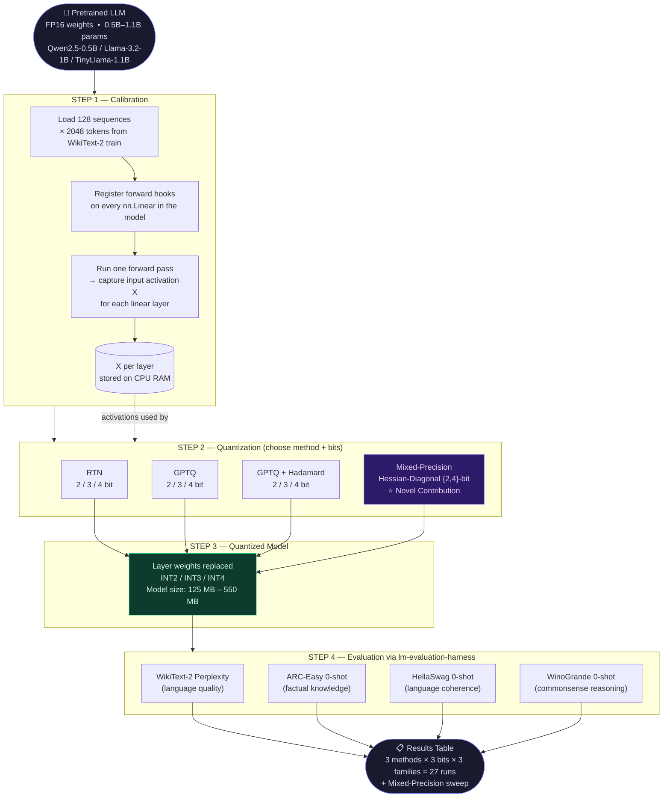

# Architecture-Agnostic Layer-Wise Post-Training Quantization of LLMs
### BTech Final Year Project | Faqre Alam · Guneet Toppo · Ekansh Agrawal
**Delhi Technological University | 2026–27**

---

## Project Summary

This repository implements a unified, architecture-agnostic **Post-Training Quantization (PTQ)** framework for decoder-only Large Language Models and conducts a controlled cross-architecture ablation study.

**Research questions:**
1. Which PTQ components transfer across model families, and which are architecture-specific?
2. Can a cheap, closed-form Hessian-diagonal sensitivity score allocate bits better than uniform precision at equal memory budget?

### 🗺️ End-to-End Pipeline



---

## 📚 Documentation

- [**Full Project Flowchart**](flowchart.md): Visualizes the exact data flow and pipeline structure for Phase 1.
- [**Deep Research Reference**](docs/deep_research.md): The comprehensive master document covering the memory wall problem, quantization mathematics, literature survey, experimental design, and the novel Hessian-Diagonal methodology.

---

## Repository Structure

```
final-year-btp/
├── requirements.txt
├── flowchart.md               ← full project flowchart (Mermaid)
│
├── phase0/                    ✅ Complete — NumPy proofs-of-concept
│
├── phase1/                    🔄 Active — PyTorch ablation grid
│   ├── run.py                 ← ENTRY POINT — run this
│   ├── configs/
│   │   └── run_config.yaml   ← all experiment settings
│   ├── framework/
│   │   ├── calibrate.py      ← WikiText-2 activation capture
│   │   ├── quantize.py       ← RTN + GPTQ + GPTQ+Hadamard
│   │   └── evaluate.py       ← lm-eval wrapper + CSV logger
│   └── results/
│       └── ablation_table.csv
│
├── phase2/                    📅 Jan–Feb 2027
└── phase3/                    📅 Mar–May 2027
```

---

## Quick Start

### 1. Install dependencies
```bash
pip install -r requirements.txt
```

### 2. Dry-run — see all planned experiments
```bash
python phase1/run.py --dry-run
```

### 3. Single quick test (Qwen 0.5B, RTN, 4-bit — ~32 min on T4)
```bash
python phase1/run.py --model qwen2.5-0.5b --method rtn --bits 4
```

### 4. Full ablation grid (27 runs, ~18 GPU-hours)
```bash
python phase1/run.py
```

### 5. Validate quantize.py works correctly (no GPU needed)
```bash
python -m phase1.framework.quantize
```

---

## Methods Implemented

| Method | Description | Calibration needed? |
|:---|:---|:---:|
| `rtn` | Per-channel affine Round-To-Nearest | No |
| `gptq` | Second-order Hessian error compensation (Frantar et al., ICLR 2023) | Yes |
| `gptq_hadamard` | Randomised Hadamard rotation + GPTQ (QuIP/QuIP#) | Yes |

---

## Models Tested

| Short name | HuggingFace ID | Params | Architecture |
|:---|:---|:---:|:---|
| `qwen2.5-0.5b` | `Qwen/Qwen2.5-0.5B` | 0.5B | GQA 7:1, 24 layers |
| `llama-3.2-1b` | `meta-llama/Llama-3.2-1B` | 1.24B | GQA 4:1, 16 layers |
| `tinyllama-1.1b` | `TinyLlama/TinyLlama-1.1B-Chat-v1.0` | 1.1B | Full MHA, 22 layers |

---

## Evaluation

Results are measured via [EleutherAI lm-evaluation-harness](https://github.com/EleutherAI/lm-evaluation-harness) v0.4.3:

| Metric | Task | Direction |
|:---|:---|:---:|
| WikiText-2 Perplexity | Language modelling | ↓ lower is better |
| ARC-Easy 0-shot | Factual knowledge | ↑ higher is better |
| HellaSwag 0-shot | Language coherence | ↑ higher is better |
| WinoGrande 0-shot | Commonsense reasoning | ↑ higher is better |

---

## Key Configuration (phase1/configs/run_config.yaml)

```yaml
calibration:
  dataset: "wikitext"
  n_samples: 128      # sequences
  seq_len: 2048       # tokens per sequence
  seed: 42            # fixed for reproducibility

bits: [2, 3, 4]
methods: [rtn, gptq, gptq_hadamard]
```

---

## References

1. Frantar et al. — **GPTQ**, ICLR 2023. arXiv:2210.17323
2. Dettmers et al. — **LLM.int8()**, NeurIPS 2022. arXiv:2208.07339
3. Lin et al. — **AWQ**, MLSys 2024. arXiv:2306.00978
4. Chee et al. — **QuIP**, NeurIPS 2023. arXiv:2307.13304
5. Tseng et al. — **QuIP#**, ICML 2024. arXiv:2402.04396
6. Dong et al. — **HAWQ-V2**, NeurIPS 2020. arXiv:1911.03852
7. Yao et al. — **HAWQ-V3**, ICML 2021. arXiv:2011.10680
