# 🗺️ Project Flowchart — Architecture-Agnostic Layer-Wise PTQ of LLMs
### BTech Final Year Project | Faqre Alam · Guneet Toppo · Ekansh Agrawal | DTU | 2026–27

---

## 1. Big Picture — End-to-End Project Flow

> The complete pipeline from a pretrained model to the final results table.

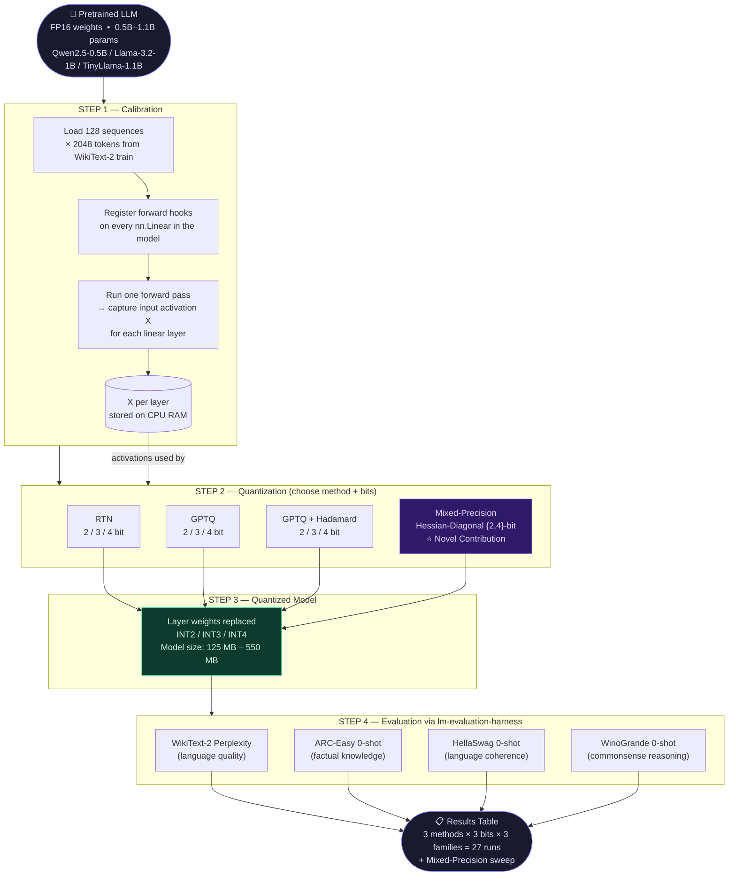

---

## 2. Calibration Data Pipeline

> Captures the per-layer activations X that ALL quantization methods depend on.

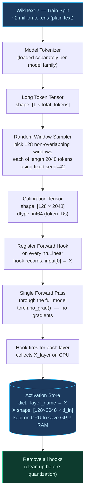

> **Why WikiText-2?** Domain-neutral, universally used, fixes the calibration distribution — so all 27 runs are directly comparable. Different calibration data shifts perplexity by 0.1–0.5 points.

---

## 3. Method 1 — RTN  (Round-To-Nearest Baseline)

> The simplest possible quantization — no calibration data used at all.

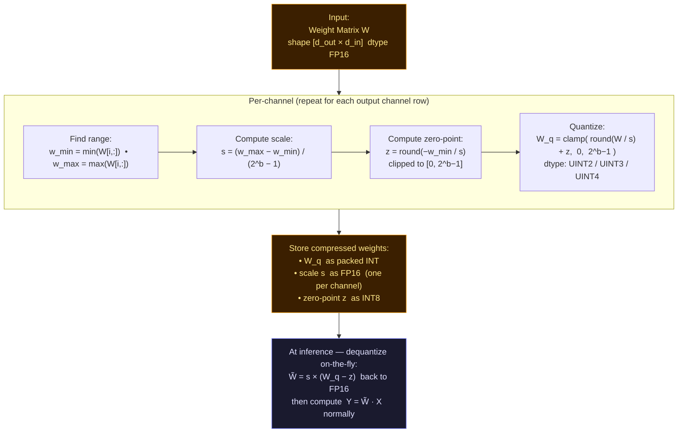

**Properties:**
| | |
|:---|:---|
| ✅ No calibration data | Zero-shot compression |
| ✅ O(d_out × d_in) | Fastest method |
| ❌ No error correction | Brutal at 2-bit |
| ❌ Quant error = s²/12 | Grows fast as bits decrease |

---

## 4. Method 2 — GPTQ  (Second-Order Error Compensation)

> Uses calibration activations to build a Hessian, then compensates for each column's quantization error by adjusting remaining unquantized columns.

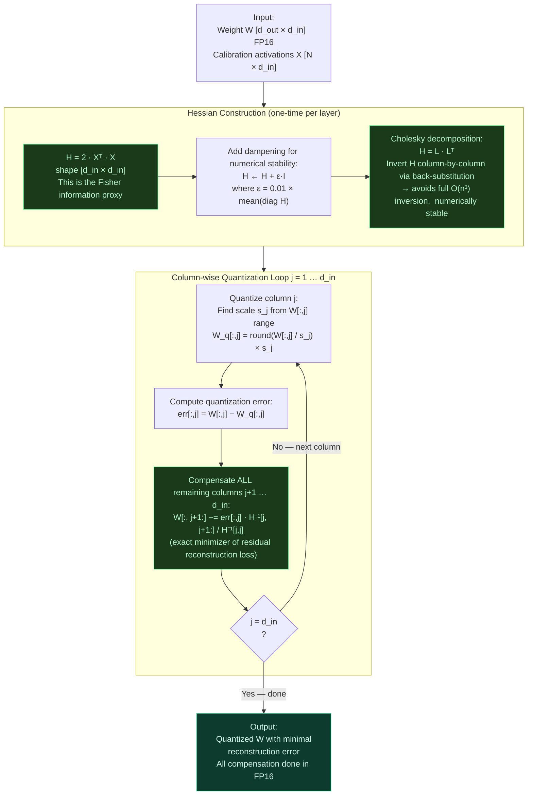

> **Key insight:** Quantizing column j introduces error `err`. The update `W[:, j+1:] -= err · H⁻¹[j, j+1:] / H⁻¹[j,j]` is the *exact* closed-form solution that minimises the residual squared reconstruction error for all future columns simultaneously.

---

## 5. Method 3 — GPTQ + Hadamard Incoherence

> Before applying GPTQ, rotate the weight matrix so that no column is an outlier. This spreads quantization pain uniformly — critical for 2-bit.

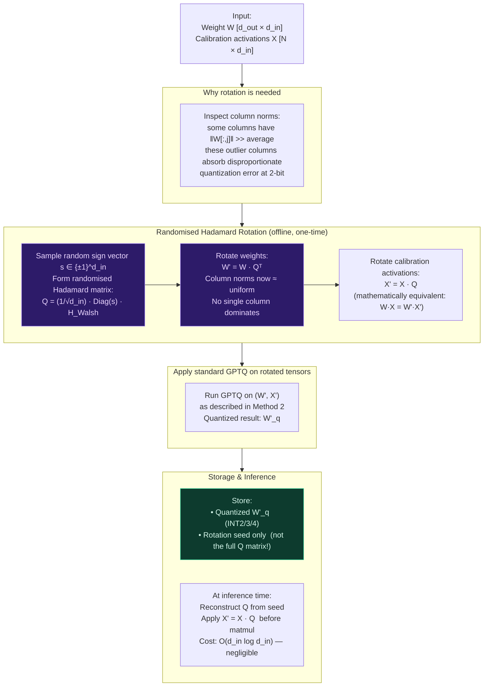

**Effect of Hadamard rotation:**
```
BEFORE  col7: [0.003, 0.002, ..., 148.7, 0.001]   ← outlier!
AFTER   col7: [0.81,  0.79,  ...,  0.82, 0.80 ]   ← uniform ✅

Guarantee:  E[max_j ‖W'[:,j]‖²]  ≈  ‖W‖²_F / d_in   (concentration bound)
```

---

## 6. ⭐ Novel Contribution — Hessian-Diagonal Mixed-Precision Allocation

> Assign different bit-widths to different weight columns based on their *quantization sensitivity* — all within a fixed average bit budget.

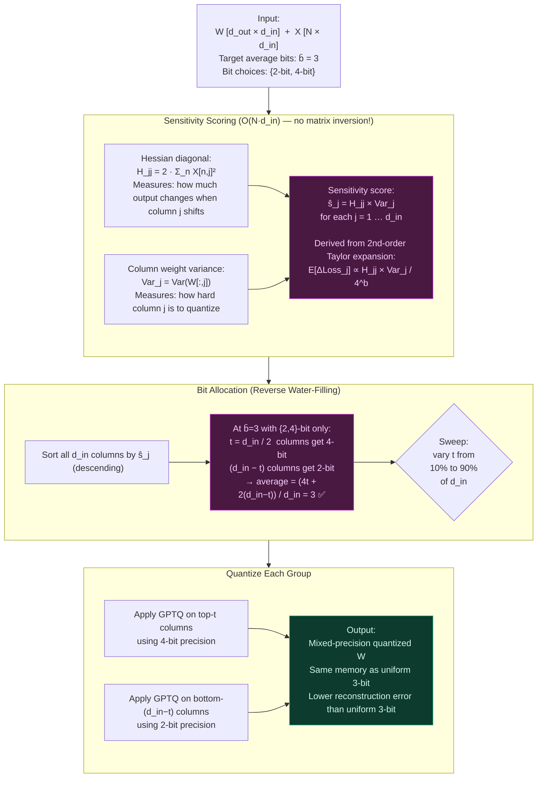

**The budget comparison at equal average bits:**
```
Config                 Bits per column              Avg bits   Memory
─────────────────────────────────────────────────────────────────────
All 2-bit              [2, 2, 2, 2, 2, 2, 2, 2]     2.0 bits   ~125 MB
Uniform 3-bit  ←base   [3, 3, 3, 3, 3, 3, 3, 3]     3.0 bits   ~190 MB
Your method    ←novel   [4, 4, 4, 4, 2, 2, 2, 2]     3.0 bits   ~190 MB  ✅ better PPL
All 4-bit              [4, 4, 4, 4, 4, 4, 4, 4]     4.0 bits   ~250 MB
                        ↑ sensitive     ↑ insensitive
```

---

## 7. The 27-Run Ablation Grid

> The controlled cross-architecture study that is the core empirical contribution.

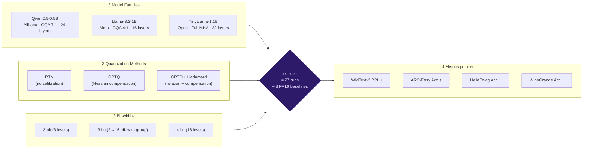

**Expected quality ordering at each bit-width:**

| Bit-width | RTN | GPTQ | GPTQ+H |
|:---:|:---:|:---:|:---:|
| 4-bit | ⚠️ slight drop | ✅ near-lossless | ✅ near-lossless |
| 3-bit | ❌ noticeable | ✅ good | ✅ good |
| 2-bit | 💀 catastrophic | ⚠️ structured loss | ✅ best (~13% better than GPTQ) |

---

## 8. Evaluation Pipeline

> How each of the 27 quantized models is measured after compression.

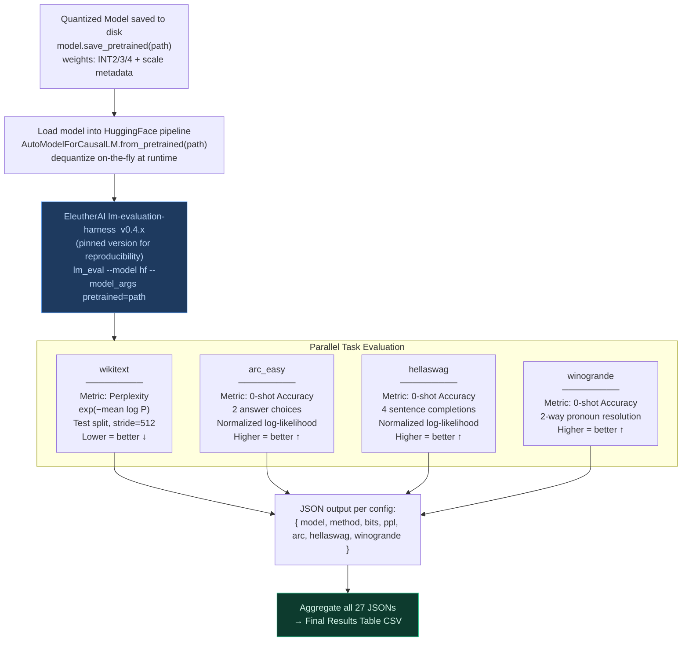

---

## 9. Architecture Comparison — Why These 3 Families?

> Each family differs in how attention is structured, making them non-trivial to compare.

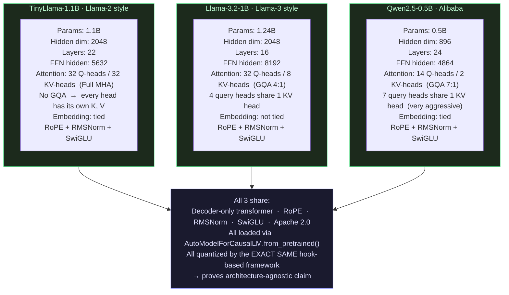

**Research question encoded here:**
> GQA ratio (7:1 vs 4:1 vs none) changes the parameter count and activation profile of `k_proj` and `v_proj`. Does the Hessian-diagonal sensitivity score correctly identify these differences — without any architecture-specific code?

---

## 10. Memory & Compute Budget on Kaggle T4

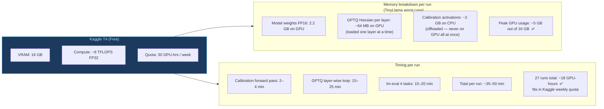

| Model | Calibration | GPTQ | Eval | **Total/run** |
|:---|:---:|:---:|:---:|:---:|
| Qwen2.5-0.5B | 2 min | 15 min | 15 min | **~32 min** |
| Llama-3.2-1B | 3 min | 15 min | 20 min | **~38 min** |
| TinyLlama-1.1B | 4 min | 25 min | 20 min | **~49 min** |
| **27 runs total** | | | | **~18 GPU-hours ✅** |

---

## 11. Complete Low-Level Implementation Data Flow

> Exact code-level execution order for Phase 1.

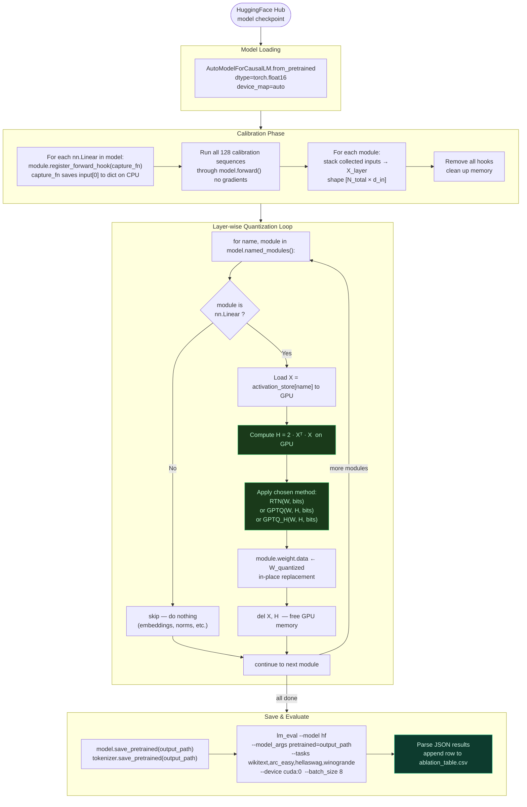

---

## 12. Your Novel Method vs. Prior Work

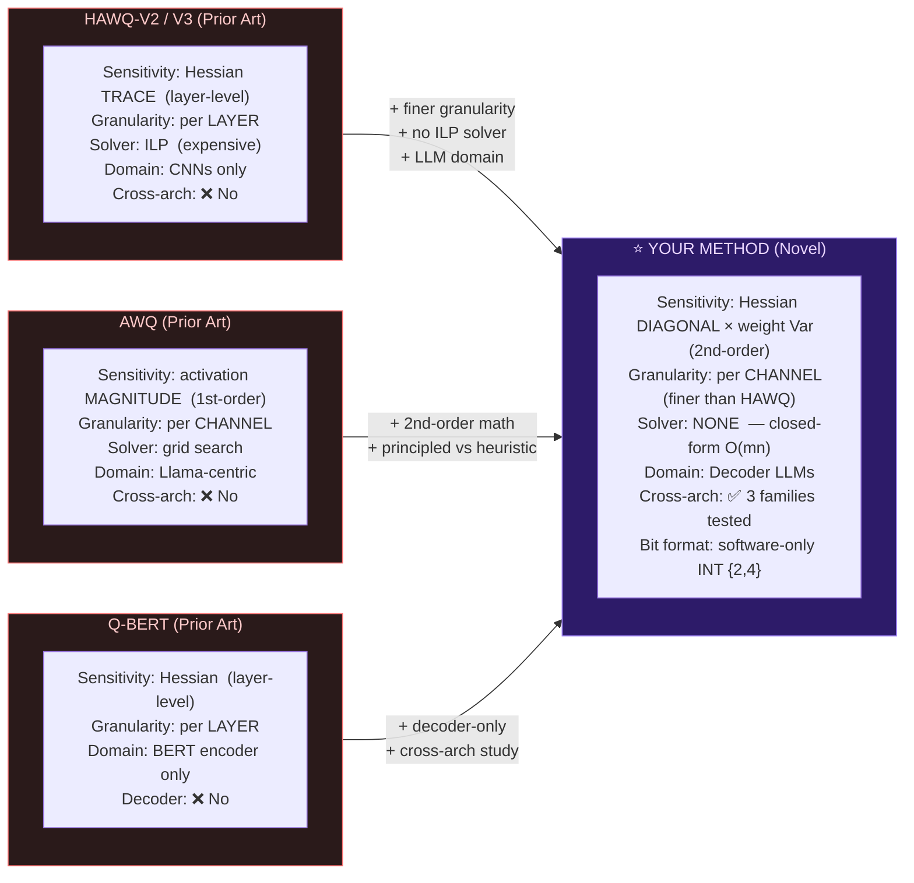

---

## 13. Expected Results  (Qualitative)

### Perplexity at 2-bit  (lower = better)

```
FP16 baseline       ████  ~7 PPL

RTN 2-bit           ████████████████████████████████████  100+ PPL  💀 catastrophic

GPTQ 2-bit          ██████████████████  40–60 PPL          ⚠️ large but structured

GPTQ+Hadamard 2-bit █████████████  25–35 PPL              ✅ ~13% better than GPTQ

Mixed {2,4} avg=3b  █████████  15–20 PPL                  ⭐ your method — best!

Uniform 3-bit GPTQ  ████████  12–15 PPL                   ← direct comparison baseline
```

### Cross-architecture transfer — what the 27-run table will reveal

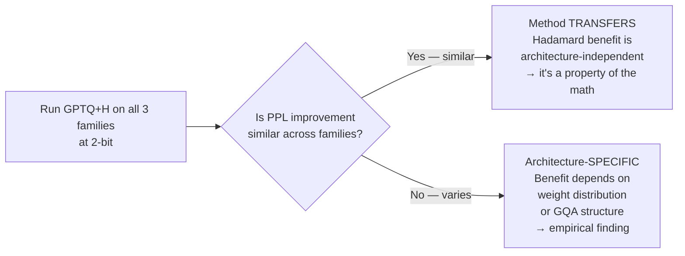

---

## 14. GitHub Repository Structure

```
final-year-btp/
│
├── flowchart.md                    ← this file
├── README.md                       ← project overview + main results table
│
├── phase0/                         ✅ COMPLETE
│   ├── demo_quant.py               ← NumPy RTN + GPTQ + Hadamard (~200 lines)
│   ├── math_proofs.pdf             ← grid error lemma, water-filling derivation
│   └── phase0_report.pdf           ← 6-page compiled LaTeX report
│
├── phase1/                         🔄 IN PROGRESS  (Oct–Dec 2026)
│   ├── framework/
│   │   ├── calibrate.py            ← hook-based activation capture
│   │   ├── quantize.py             ← RTN, GPTQ, GPTQ+H  (PyTorch, arch-agnostic)
│   │   └── evaluate.py             ← lm-eval wrapper + JSON → CSV
│   ├── configs/
│   │   └── run_config.yaml         ← model IDs, bit-widths, methods, random seed
│   └── results/
│       └── ablation_table.csv      ← 27-run results + FP16 baselines
│
├── phase2/                         📅 Jan–Feb 2027
│   ├── mixed_precision.py          ← Hessian-diagonal allocation algorithm
│   ├── sweep.py                    ← vary t (10%→90%), trace PPL vs avg-bits curve
│   └── results/
│       └── mixedprec_results.csv
│
├── phase3/                         📅 Mar–May 2027
│   ├── paper/
│   │   ├── main.tex                ← ACL-style LaTeX paper
│   │   └── figures/                ← all plots + result tables
│   └── analysis/
│       └── plot_results.py         ← generate all paper figures from CSVs
│
└── data/
    └── calibration/
        └── wikitext2_calib_seed42.pt   ← saved calibration tensors
                                           load once, reuse across all 27 runs
```

---

*Compiled: September 2026 · Faqre Alam · Guneet Toppo · Ekansh Agrawal · BTech Computer Engineering · Delhi Technological University*
